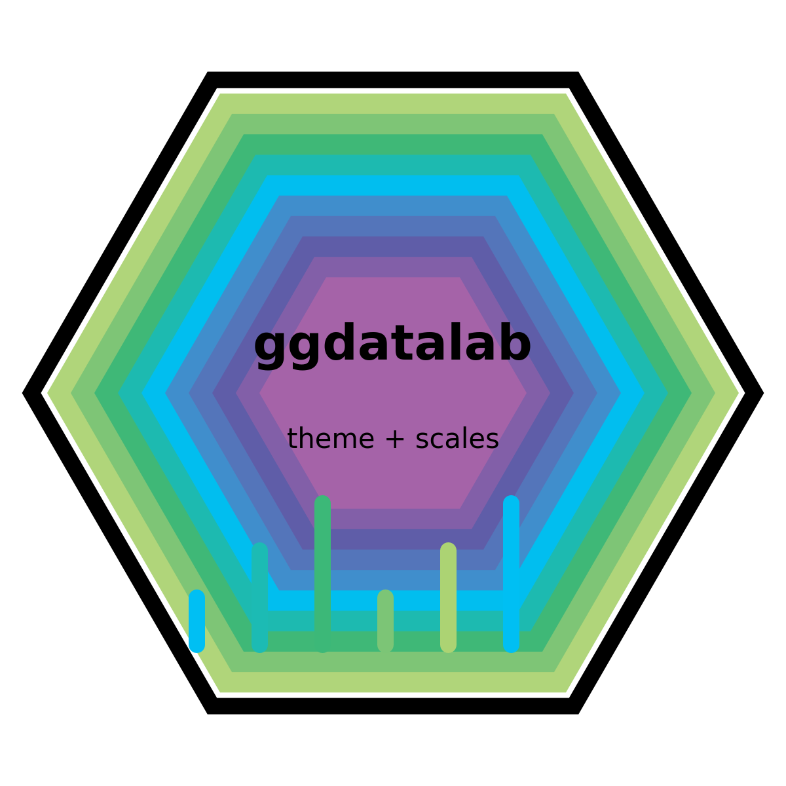

<p align="center">
  
</p>

# ggdatalab

A lightweight **ggplot2 extension** providing a clean, opinionated theme and a
coherent colour system for **discrete** and **continuous** data.

The package is designed to be:
- visually consistent
- CRAN-compliant
- boring in the good way

---

## Installation

### From GitHub

```r
install.packages("remotes")
remotes::install_github("kubdatalab/ggdatalab", build_vignettes = TRUE)
```

---

## Quick start

```r
library(ggplot2)
library(ggdatalab)

ggplot(mtcars, aes(wt, mpg, colour = hp)) +
  geom_point(size = 3) +
  scale_colour_datalab_c() +
  theme_datalab()
```

---

## What’s included

### Theme

- `theme_datalab()`

A minimal theme based on `theme_minimal()` with:
- restrained grid
- clear typography
- sensible defaults for publications and reports

### Discrete colour scales

- `scale_fill_datalab_d()`
- `scale_colour_datalab_d()`
- `scale_color_datalab_d()` (US spelling)

### Continuous colour scales

- `scale_fill_datalab_c()`
- `scale_colour_datalab_c()`
- `scale_color_datalab_c()` (US spelling)

### Palette helpers

- `datalab_cols()`
- `datalab_pal(type = c("discrete", "continuous"))`

---

## Vignette

A full introduction with examples is available as a vignette:

```r
vignette("using-ggdatalab")
```

Or browse all vignettes:

```r
browseVignettes("ggdatalab")
```

---

## Development status

- ✔ R CMD check (GitHub Actions)
- ✔ Testthat tests
- ✔ Vignette
- ✔ pkgdown-ready
- ✔ CRAN-check clean (local)

---

## License

MIT © KUB Datalab
