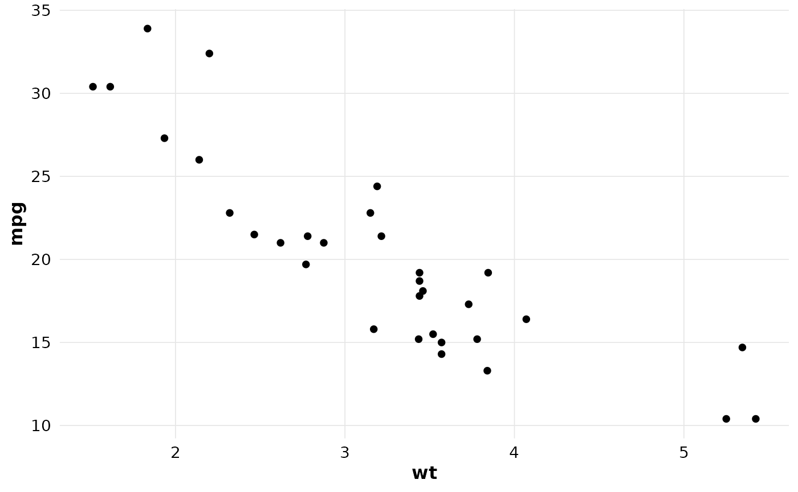
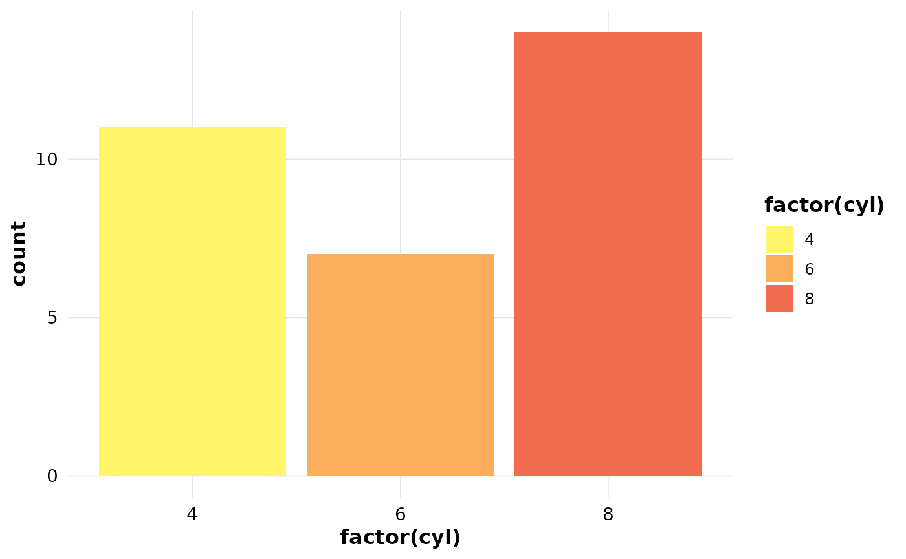
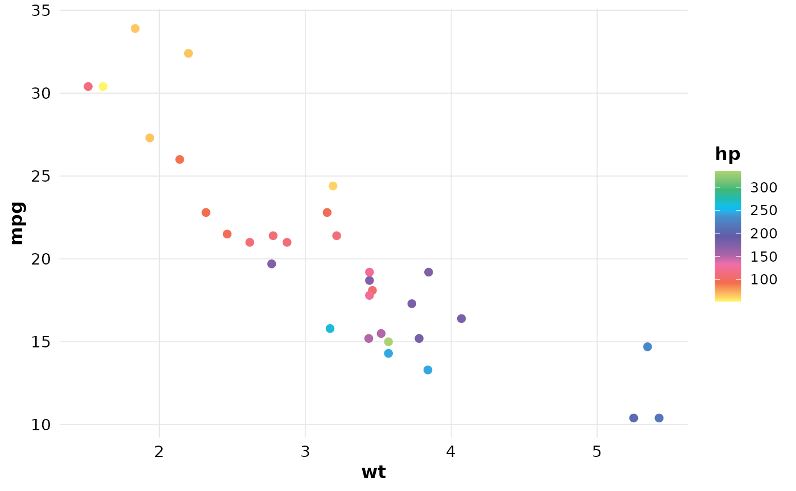

# 

##  

title: “Using ggdatalab” output: rmarkdown::html_vignette vignette: \> %
% % —

`ggdatalab` provides a ggplot2 theme and colour scales.

## Theme

``` r
library(ggplot2)
library(ggdatalab)

ggplot(mtcars, aes(wt, mpg)) +
  geom_point() +
  theme_datalab()
```



## Discrete scales

``` r
ggplot(mtcars, aes(factor(cyl), fill = factor(cyl))) +
  geom_bar() +
  scale_fill_datalab_d() +
  theme_datalab()
```



## Continuous scales

``` r
ggplot(mtcars, aes(wt, mpg, colour = hp)) +
  geom_point(size = 2) +
  scale_colour_datalab_c() +
  theme_datalab()
```


